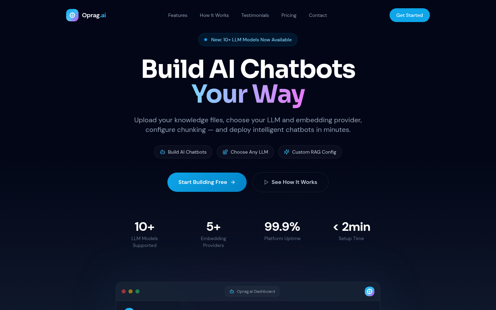
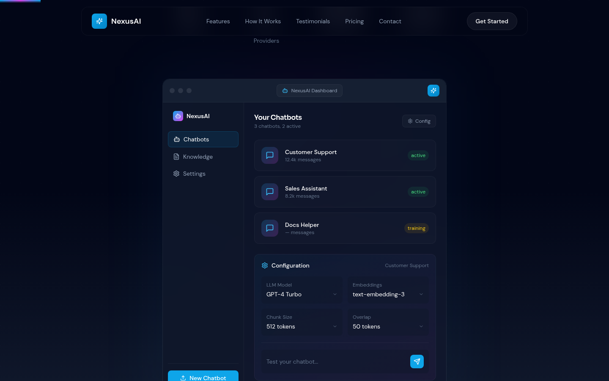
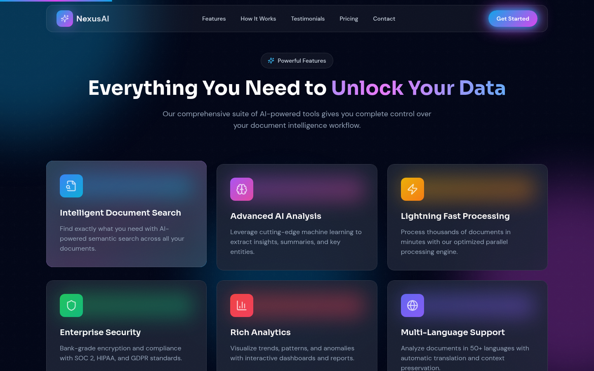
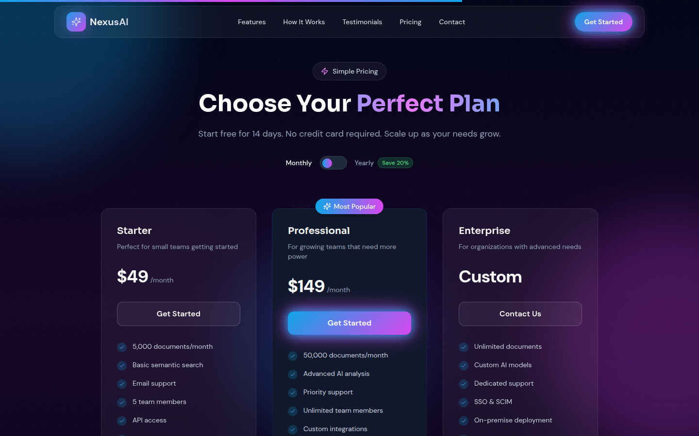
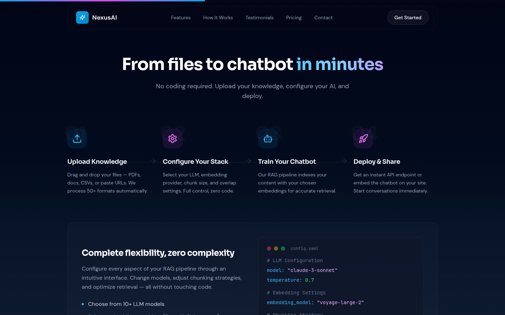
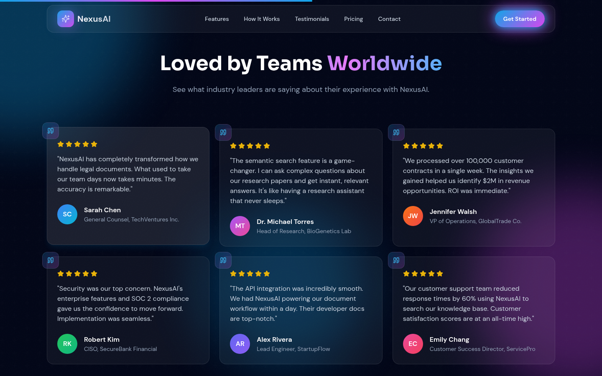
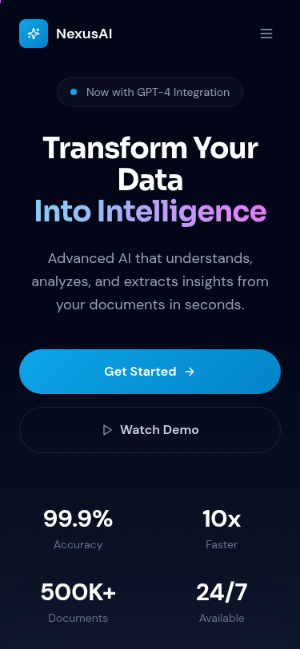

# Landing Page Screenshots

Screenshots showcasing the NexusAI Chatbot Builder landing page.

## 1. Hero Section
Main hero with "Build AI Chatbots Your Way" messaging, highlighting LLM flexibility, embedding providers, and custom RAG config.

---

## 2. Product Demo - Chatbot Dashboard
Interactive product demo showing the chatbot management interface with configuration options for LLM models, embeddings, chunk size, and overlap.

---

## 3. Features Section
Key features: Multiple LLM Providers, Flexible Embeddings, Custom Chunk Config, Simple File Upload, Instant Chatbots, Enterprise Security.

---

## 4. Supported Providers
Provider showcase with OpenAI, Anthropic, Google AI, Cohere, Mistral, and Voyage AI. Includes example YAML configuration.

---

## 5. How It Works
4-step flow: Upload Knowledge → Configure Stack → Train Chatbot → Deploy & Share. Includes detailed config example.

---

## 6. Testimonials
Customer testimonials highlighting model flexibility, RAG tuning, and cost optimization benefits.

---

## 7. Mobile Responsive View
Mobile-optimized layout with the same chatbot builder messaging.

